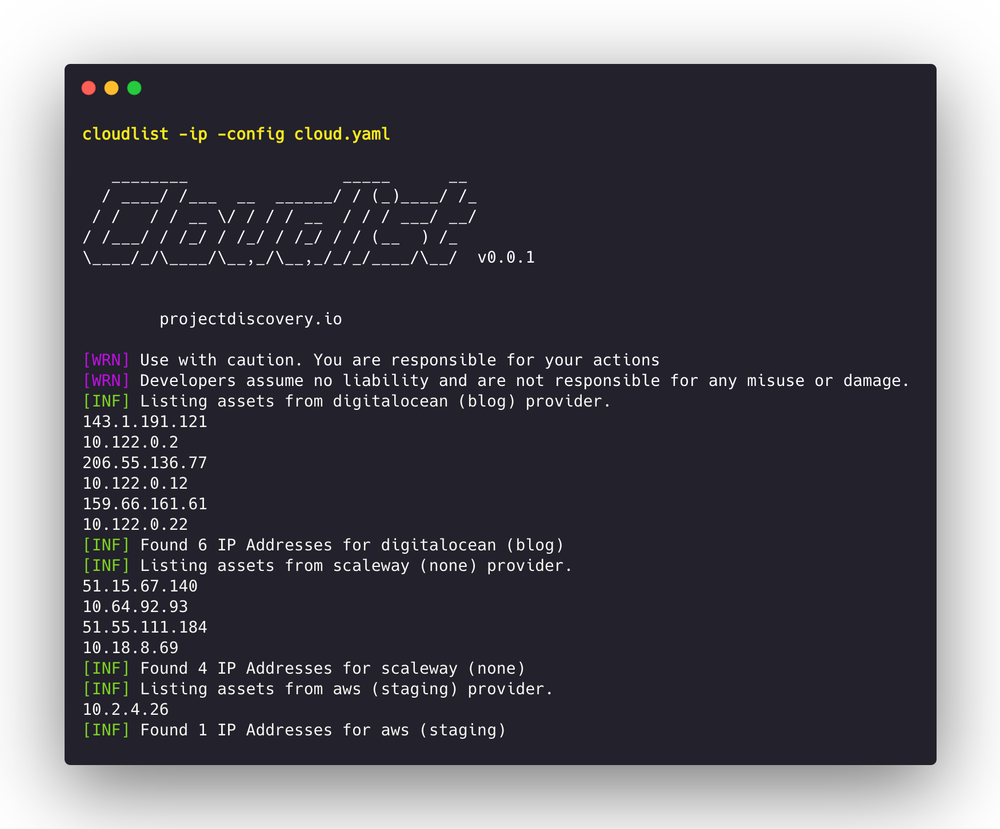

<h1 align="center">
  </a>
  <br>
</h1>


<p align="center">
<a href="https://opensource.org/licenses/MIT"></a>
<a href="https://github.com/projectdiscovery/cloudlist/issues"></a>
<a href="https://goreportcard.com/badge/github.com/projectdiscovery/cloudlist"></a>
<a href="https://github.com/projectdiscovery/cloudlist/releases"></a>
<a href="https://twitter.com/pdiscoveryio"></a>
<a href="https://discord.gg/projectdiscovery"></a>
</p>

<p align="center">
  <a href="#features">Features</a> •
  <a href="#installation-instructions">Installation</a> •
  <a href="#usage">Usage</a> •
  <a href="#configuration-file">Configuration</a> •
  <a href="#running-cloudlist">Running cloudlist</a> •
  <a href="#supported-providers">Supported providers</a> •
  <a href="#cloudlist-as-a-library">Library</a> •
  <a href="https://discord.gg/projectdiscovery">Join Discord</a>
</p>


Cloudlist is a multi-cloud tool for getting Assets (Hostnames, IP Addresses) from Cloud Providers. This is intended to be used by the blue team to augment Attack Surface Management efforts by maintaining a centralized list of assets across multiple clouds with very little configuration efforts.


# Features

<h1 align="left">
  </a>
  <br>
</h1>


 - Easily list Cloud assets with multiple configurations.
 - Multiple cloud providers support.
 - Highly extensible making adding new providers a breeze.
 - **stdout** support to work with other tools in pipelines.

# Usage

```sh
cloudlist -h
```

This will display help for the tool. Here are all the switches it supports.

```yaml
Usage:
  ./cloudlist [flags]

Flags:
CONFIGURATION:
   -config string                cloudlist flag config file (default "$HOME/.config/cloudlist/config.yaml")
   -pc, -provider-config string  provider config file (default "$HOME/.config/cloudlist/provider-config.yaml")

FILTERS:
   -p, -provider string[]  display results for given providers (comma-separated)
   -id string[]            display results for given ids (comma-separated)
   -host                   display only hostnames in results
   -ip                     display only ips in results
   -ep, -exclude-private   exclude private ips in cli output

OUTPUT:
   -o, -output string  output file to write results
   -json               write output in json format
   -version            display version of cloudlist
   -v                  display verbose output
   -silent             display only results in output
```

# Installation Instructions


Download the ready to use binary from [release page](https://github.com/projectdiscovery/cloudlist/releases/) or install/build using Go

```sh
go install -v github.com/projectdiscovery/cloudlist/cmd/cloudlist@latest
```

# Running Cloudlist

```
cloudlist
```

This will list all the assets from configured providers in the configuration file. Specific providers and asset type can also be specified using `provider` and `id` filter.

```console
cloudlist -provider aws,gcp

   ________                _____      __ 
  / ____/ /___  __  ______/ / (_)____/ /_
 / /   / / __ \/ / / / __  / / / ___/ __/
/ /___/ / /_/ / /_/ / /_/ / / (__  ) /_  
\____/_/\____/\__,_/\__,_/_/_/____/\__/  v0.0.1        

    projectdiscovery.io

[WRN] Use with caution. You are responsible for your actions
[WRN] Developers assume no liability and are not responsible for any misuse or damage.
[INF] Listing assets from AWS (prod) provider.
example.com
example2.com
example3.com
1.1.1.1
2.2.2.2
3.3.3.3
4.4.4.4
5.5.5.5
6.6.6.6
[INF] Found 2 hosts and 6 IPs from AWS service (prod)
```
## Running cloudlist with Nuclei

Scanning assets from various cloud providers with nuclei for security assessments:- 

```bash
cloudlist -silent | httpx -silent | nuclei -t cves/
```

# Supported providers

- AWS (Amazon web services)
  - EC2
  - Route53
- GCP (Google Cloud Platform)
  - Cloud DNS
- DO (DigitalOcean)
  - Instances
- SCW (Scaleway)
  - Instances
- Fastly
  - Services
- Heroku
  - Applications
- Linode
  - Instances
- Azure
  - Virtual Machines
- Namecheap
  - Domain List
- Alibaba Cloud
  - ECS Instances
- Cloudflare
  - DNS
- Hashistack
  - Nomad
  - Consul
  - Terraform


# Configuration file

The default provider config file should be located at `$HOME/.config/cloudlist/provider-config.yaml` and has the following contents as an example. In order to run this tool, the keys need to updated in the config file.

```yaml
- # provider is the name of the provider
  provider: do
  # id is the name of the provider id
  id: xxxx
  # digitalocean_token is the API key for digitalocean cloud platform
  digitalocean_token: xxxxxxxxxxxxxxxxxxxxxxxxxxxxxxxxxxxxxxxxxxxxxxxxxxxx

- # provider is the name of the provider
  provider: scw
  # scaleway_access_key is the access key for scaleway API
  scaleway_access_key: SCWXXXXXXXXXXXXXX
  # scaleway_access_token is the access token for scaleway API
  scaleway_access_token: xxxxxx-xxxx-xxxx-xxxx-xxxxxxxxxx

- # provider is the name of the provider
  provider: aws
  # id is the name of the provider id
  id: staging
  # aws_access_key is the access key for AWS account
  aws_access_key: AKIAXXXXXXXXXXXXXX
  # aws_secret_key is the secret key for AWS account
  aws_secret_key: xxxxxxxxxxxxxxxxxxxxxxxxxxxxxxxxxxxx
  # aws_session_token session token for temporary security credentials retrieved via STS (optional)
  aws_session_token: xxxxxxxxxxxxxxxxxxxxxxxxxxxxxxxxxxxx
- # provider is the name of the provider (Google Cloud Platform)
  provider: gcp
  # profile is the name of the provider profile
  id: logs
  # gcp_service_account_key is the minified json of a google cloud service account with list permissions
  gcp_service_account_key: '{xxxxxxxxxxxxx}'
- # provider is the name of the provider
  provider: azure
  # id is the name of the provider id
  id: staging
  # client_id is the client ID of registered application of the azure account (not requuired if using cli auth)
  client_id: xxxxxxxxxxxxxxxxxxxxxxxxx
  # client_secret is the secret ID of registered application of the zure account (not requuired if using cli uth)
  client_secret: xxxxxxxxxxxxxxxxxxxxx
  # tenant_id is the tenant ID of registered application of the azure account (not requuired if using cli auth)
  tenant_id: xxxxxxxxxxxxxxxxxxxxxxxxx
  #subscription_id is the azure subscription id
  subscription_id: xxxxxxxxxxxxxxxxxxx
  #use_cli_auth if set to true cloudlist will use azure cli auth
  use_cli_auth: true
- # provider is the name of the provider
  provider: cloudflare
  # email is the email for cloudflare
  email: user@domain.com
  # api_key is the api_key for cloudflare
  api_key: xxxxxxxxxxxxxxxxxxxxxxxxxxxxxxxxxxxx
- # provider is the name of the provider
  provider: heroku
  # id is the name of the provider id
  id: staging
  # heroku_api_token is the api key for Heroku account
  heroku_api_token: xxxxxxxxxxxxxxxxxxxx
- # provider is the name of the provider
  provider: linode
  # id is the name of the provider id
  id: staging
  # linode_personal_access_token is the personal access token for linode account
  linode_personal_access_token: XXXXXXXXXXXXXXXXXXXXXXXX
- # provider is the name of the provider
  provider: fastly
  # id is the name of the provider id
  id: staging
  # fastly_api_key is the personal API token for fastly account
  fastly_api_key: XX-XXXXXXXXXXXXXXXXXXXXXX-
- # provider is the name of the provider
  provider: alibaba
  # id is the name of the provider id
  id: staging
  # alibaba_region_id is the region id of the resources
  alibaba_region_id: ap-XXXXXXX
  # alibaba_access_key is the access key ID for alibaba cloud account
  alibaba_access_key: XXXXXXXXXXXXXXXXXXXX
  # alibaba_access_key_secret is the secret access key for alibaba cloud account
  alibaba_access_key_secret: XXXXXXXXXXXXXXXX
- # provider is the name of the provider
  provider: namecheap
  # id is the name of the provider id
  id: staging
  # namecheap_api_key is the api key for namecheap account
  namecheap_api_key: XXXXXXXXXXXXXXXXXXXXXXX
  # namecheap_user_name is the username of the namecheap account
  namecheap_user_name: XXXXXXX
- # provider is the name of the provider
  provider: terraform
  # id is the name of the provider id
  id: staging
  #tf_state_file is the location of terraform state file (terraform.tfsate) 
  tf_state_file: path/to/terraform.tfstate
- # provider is the name of the provider
  provider: nomad
  # nomad_url is the url for nomad server
  nomad_url: http:/127.0.0.1:4646/
  # nomad_ca_file is the path to nomad CA file
  # nomad_ca_file: <path-to-ca-file>.pem
  # nomad_cert_file is the path to nomad Certificate file
  # nomad_cert_file: <path-to-cert-file>.pem
  # nomad_key_file is the path to nomad Certificate Key file
  # nomad_key_file: <path-to-key-file>.pem
  # nomad_token is the nomad authentication token
  # nomad_token: <nomad-token>
  # nomad_http_auth is the nomad http auth value
  # nomad_http_auth: <nomad-http-auth-value>
- # provider is the name of the provider
  provider: consul
  # consul_url is the url for consul server
  consul_url: http://localhost:8500/
  # consul_ca_file is the path to consul CA file
  # consul_ca_file: <path-to-ca-file>.pem
  # consul_cert_file is the path to consul Certificate file
  # consul_cert_file: <path-to-cert-file>.pem
  # consul_key_file is the path to consul Certificate Key file
  # consul_key_file: <path-to-key-file>.pem
  # consul_http_token is the consul authentication token
  # consul_http_token: <consul-token>
  # consul_http_auth is the consul http auth value
  # consul_http_auth: <consul-http-auth-value>
```

# Contribution

Please check [PROVIDERS.md](https://github.com/projectdiscovery/cloudlist/blob/main/PROVIDERS.md) and [DESIGN.md](https://github.com/projectdiscovery/cloudlist/blob/main/DESIGN.md) to include support for new cloud providers in Cloudlist.


- Fork this project
- Create your feature branch (`git checkout -b new-provider`)
- Commit your changes (`git commit -am 'Added new cloud provider'`)
- Push to the branch (`git push origin new-provider`)
- Create new Pull Request

# Cloudlist as a library

It's possible to use the library directly in your go programs. The following code snippets outline how to list assets from all or given cloud provider.

```go
package main

import (
  "context"
  "log"

  "github.com/projectdiscovery/cloudlist/pkg/inventory"
  "github.com/projectdiscovery/cloudlist/pkg/schema"
)

func main() {
  inventory, err := inventory.New(schema.Options{
    schema.OptionBlock{"provider": "digitalocean", "digitalocean_token": "ec405badb974fd3d891c9223245f9ab5871c127fce9e632c8dc421edd46d7242"},
  })
  if err != nil {
    log.Fatalf("%s\n", err)
  }

  for _, provider := range inventory.Providers {
    resources, err := provider.Resources(context.Background())
    if err != nil {
      log.Fatalf("%s\n", err)
    }
    for _, resource := range resources.Items {
      _ = resource // Do something with the resource
    }
  }
}
```

## Acknowledgments

Thank you for inspiration

* [Smogcloud](https://github.com/BishopFox/smogcloud)
* [Cloudmapper](https://github.com/duo-labs/cloudmapper)

## License

cloudlist is made with 🖤 by the [projectdiscovery](https://projectdiscovery.io) team and licensed under [MIT](https://github.com/projectdiscovery/cloudlist/blob/main/LICENSE.md)
